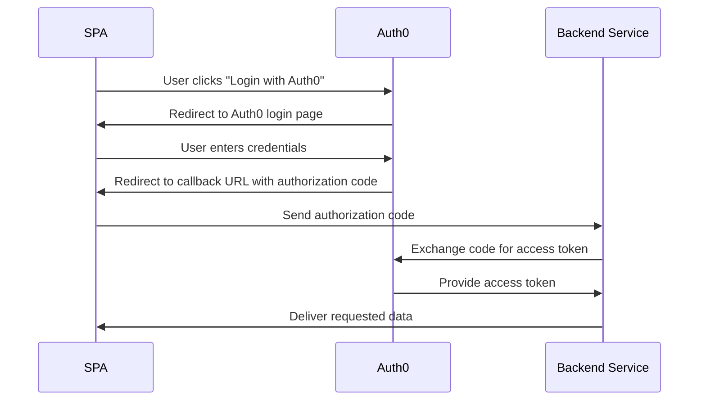

In our previous blog post, we showcased the simplicity and speed of creating static landing sites with Hugo. However, when the need for dynamic and interactive web experiences arises, Nuxt.js and Vue.js step in to offer powerful solutions.

Nuxt.js and Vue.js provide a versatile approach for building dynamic web applications, offering benefits such as server-side rendering (SSR) or Single Page Application (SPA) behavior akin to static sites. This hybrid approach ensures better performance, SEO optimization, and enhanced user experience compared to purely static sites. Additionally, Vue.js's component-based architecture and intuitive syntax make development straightforward and enjoyable.

Let's dive into building a Nuxt.js demo application, complete with login capabilities integrated using Auth0, to unlock the full potential of dynamic web experiences.

# What is the Difference between a Static Site vs SPA?

Single Page Applications (SPAs) have transformed web development, ushering in an era of seamless user experiences through dynamic content loading sans full-page refreshes. By fetching data asynchronously, SPAs deliver lightning-fast load times and fluid interactions, captivating users with their responsiveness.

In contrast, static sites pre-render content during build time, serving up crisp, pre-generated files directly to users. This approach bypasses server-side processing, unleashing unrivaled speed and scalability upon the digital landscape.

Now, imagine a fusion of these two paradigms—SPAs and static sites—ushering in a new era of web development innovation. Enter frameworks like Nuxt.js, seamlessly blending the dynamic prowess of SPAs with the rapid deployment capabilities of static site generation. With features like server-side rendering (SSR), static site generation (SSG), and effortless plugin integration, Nuxt.js empowers developers to craft web experiences that are as dynamic as they are efficient.

# What is OAuth Protocol About?

OAuth has become the de facto standard for secure authentication and authorization on the web. It enables users to leverage login credentials from third-party applications (such as GitHub, Google, etc.) without sharing their credentials directly.

These systems provide limited access to user contact information or resources without sharing their credentials.

OAuth's protocol flow involves authentication servers, authorization grants, and access tokens, ensuring secure communication between the user, client application, and resource server.

The following diagram outlines the typical flow of implementing a web app that supports OAuth.


**Flow Explanation:**

1. The user clicks on the "Login with Auth0" button in the browser (SPA).
2. The browser initiates a request to Auth0.
3. Auth0 redirects the browser to its login page.
4. The user enters their credentials.
5. Auth0 verifies the credentials and redirects the browser back to the SPA with an authorization code.
6. The browser sends the authorization code to the backend service.
7. The backend service exchanges the authorization code for an access token by making a request to Auth0.
8. mAuth0 validates the authorization code and issues an access token to the backend service.
9. The backend service uses the access token to request the required data from Auth0.
10. Auth0 verifies the access token and provides the requested data to the backend service.
11. Finally, the backend service delivers the requested data to the browser.

## What is Auth0?

Implementing OAuth authentication for every web application can indeed be cumbersome and intricate. Fortunately, authentication aggregation services like Auth0 exist to alleviate these challenges. They not only handle the complexities of authentication protocols and security measures but also simplify the integration process into your application with just a few lines of code.

With Auth0, developers can leverage a comprehensive suite of authentication and authorization features, including user management, social login integrations, multi-factor authentication, and more. By abstracting away the intricacies of OAuth implementation and providing a user-friendly dashboard for configuration, Auth0 empowers developers to focus on building their applications' core functionality without compromising on security or user experience.

---

Step-by-Step Guide for OAuth Authentication with Auth0
=======================================================

## 1. Create or Login to Auth0

## 2. Create a New Application


## 2. Select the Application Type


1. Fill out the name for the new application
2. Ensure you select `Single Page App`
3. Select `Vue` (or your favorite framework)
4. Click the `Continue` Button
  
## 3. Download the Generated Sample
Next Auth0 will allow you to download a ready to use application for that framework!


## 4. Update your Application Settings
In this next screen, you will see getting started information for running the application locally.


To make this work, you must configure your settings for:
1. `Allowed Calledback URLs`
2. `Allowed Logout URLs`
3. and `Allowed Web Origins`
  
Notice the link in the screen shot above, open a tab so that you can update the settings as shown below.


Once done, save the settings.

## 5. Select your Login Support

Next navigate to the Connections Tab. Here you can enable the "Connection" types, such as:
1. Google oauth2 authentication
2. Github OAuth2 authentication
3. and even 'username and password' base authentication
  
Make you selection and save your settings.

  

## 5. Configure and Run the Application Locally

Now with all the configuration out of the way, we can start working with the downloaded project from our previous step.

1. Unpack the downloaded application archive, and open the code in an IDE of your choice.
  

2. The project _may_ needs to be configured with your Auth0 domain and client ID in order for the authentication flow to work. However generally the zip is pre-configured with the application identity. Let's look at them. Open `auth_config.json`, and verify the application verification domain, and client ID are correct:

  

They should match the values from the application listing in Auth0 application settings:

  


## 5. Verifying the Configuration

1. In a console, navigate to the root of the project and run:
  ```bash
  sh exec.sh
  ```
  

2. Open your browser to http://localhost:1313. You should expect to see something as below. 
  
  

3. Click the login button and select a login method to test.

  

   For example below is an example of what one might see if they clicked the github login method. Once you have reviewed and accepted the permissions - it will grant access in the users account to profile (name, email, userId). 

  

  Once this has successfully completed, we can click the drop down next to your user avatar and select `profile`. This will show you what data was captured from the user account on the provider (github, google, etc).

  

## 6. Deploying to Github Pages

Now that the first steps are successfully working, it is time to get this into source control, enable github pages, configure it to use DNS, update the settings on the application listing in Auth0. 

Many of these steps will be very similar to the steps we took in the previous post - when deploying our hugo blog to Github pages. 

1. Create a github repository
  
2. In github pages settings of the new repository, enable deployment with 1Github Actions`:
  
3. Next create a new file in the repository under the path `.github/workflows/deploy.yaml` and paste in the following content:
   
  ```yaml
  # Simple workflow for deploying static content to GitHub Pages
  name: Deploy static content to Pages

  on:
    # Runs on pushes targeting the default branch
    push:
      branches: ["main"]

    # Allows you to run this workflow manually from the Actions tab
    workflow_dispatch:

  # Sets the GITHUB_TOKEN permissions to allow deployment to GitHub Pages
  permissions:
    contents: read
    pages: write
    id-token: write

  # Allow one concurrent deployment
  concurrency:
    group: "pages"
    cancel-in-progress: true

  jobs:
    # Single deploy job since we're just deploying
    deploy:
      environment:
        name: github-pages
        url: ${{ steps.deployment.outputs.page_url }}
      runs-on: ubuntu-latest
      steps:
        - name: Checkout
          uses: actions/checkout@v4
        - name: Set up Node
          uses: actions/setup-node@v3
          with:
            node-version: 18
            cache: "npm"
        - name: Install dependencies
          run: npm install
        - name: Build
          run: npm run build
        - name: Setup Pages
          uses: actions/configure-pages@v3
        - name: Upload artifact
          uses: actions/upload-pages-artifact@v2
          with:
            # Upload dist repository
            path: "./dist"
        - name: Deploy to GitHub Pages
          id: deployment
          uses: actions/deploy-pages@v2
  ```

  Commit this change.
  

1. Navigate to the `Actions` tab in your repository. You should see the deployment job successfully complete.

  

5. Navigate to the `Github Pages` settings once more, and you will expect to see the link to your read to use site hosted on github pages.

From this point, I will leave the exercise of configuring a real domain name to you as a learning exercise. Here are a few hints:
1. You will need to update your application listing to set the `domain` of the application.
2. There are 4 settings you will make there; the 3 settings we provided above and the `Application Login URL`. 
3. If you have a custom domain, configure your DNS records - as we did in the previous post, and update the github pages settings.

# Summary
In summary, we created a static (SPA) site - that has the ability to dynamically call backend services using Vue, NuxtJS and Auth0. From here one could easily add new backend services. 

One interesting enhancement we could might is to complete the login flow. This would entail sending the Users `authorization code` provided from Auth0 to a backend API. The backend API would validate the `authorization code` and obtain a `access token`. Using this access token it would be possible to lookup user information and generate a JWT or grant document using [PASETO grant](https://paseto.io/). I may provide a guide for doing this in an upcoming post. For now, check out my finished demo at https://app.codeblind.ai. Cheers and happy coding!


