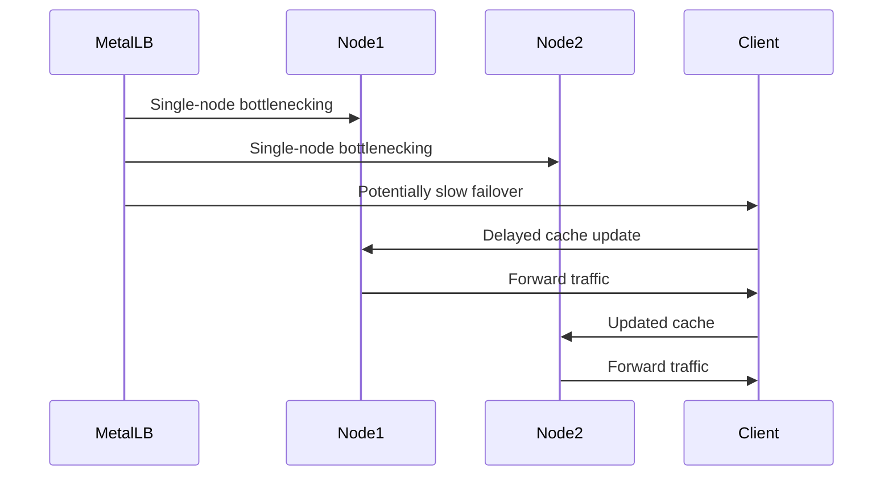

Kubernetes _does_ provide internal cluster IPs for services, but these IPs are only accessible within the cluster itself. When you deploy a service of type `LoadBalancer` in Kubernetes, it typically relies on a cloud provider's load balancer to expose the service externally. However, in environments like our Mighty Raspberry Pi 5 cluster where there is no built-in cloud infrastructure, you need an alternative solution to expose services externally.

This is where MetalLB comes in. MetalLB serves as a load balancer for Kubernetes clusters, bridging the gap between internal and external accessibility. It seamlessly assigns external IP addresses to services of type LoadBalancer, enabling external traffic to reach our cluster and be directed to the appropriate pods. But how do we unleash the power of MetalLB in our non-cloud environment?


## IP Addresses
MetalLB doesn't create IP addresses out of thin air. You must give it pools of IP addresses that it can manage. MetalLB will take care of assigning and recycling individual addresses as services come and go, but it will only ever hand out IPs that are part of its configured pools.

How - or where - you get IP address pools for MetalLB depends on your environment. If you’re running a bare-metal cluster in a collocation facility, your hosting provider probably offers IP addresses for lease. In our case, we have a home router, so we must login to the administrative console an restrict the DHCP address range assigned by our router - to create a pool which can be managed by MetalLB.

## Does this cause problems routing problems?
That is a great question reader! Typically your home router router acts as the DHCP server for your home LAN, assigning IP addresses to authorized devices, and advertise that assignment of IP to MAC using a Layer 2 mode (ARP/NDP) protocol. 

MetalLB supports both `BGP` and `Layer 2 ARP` Advertisement so our PaaS plays nice with out home network.

If you had a larger environment, such as in a co-location, you might consider BGP. But for our purposes that is overkill.


## Does Layer 2 cause bottlenecks in routing?
Astute networking question! Layer 2 mode has two main limitations you should be aware of when it comes to Kubernetes.

1. In layer 2 mode, a **single leader-elected node** handles all traffic for a service IP. This means that the ingress bandwidth of your service is restricted to the capacity of a single node, which can become a bottleneck.
2. **Failover** between nodes in layer 2 mode relies on client cooperation. When failover occurs, MetalLB sends out "gratuitous" layer 2 packets to inform clients of the change in MAC address associated with the service IP.

During unplanned failover, service IPs may become unreachable until problematic clients update their cache entries.



Hopefully this background information is enlightening, let's setup Metal LB and see how it work!

# Metal LB Quick Start

## 1. Home Router Preparation

Before diving into MetalLB configuration, it's essential to ensure we have a pool of IP addresses available. In our home network scenario, this involves tweaking the DHCP settings on our router to reserve a block of addresses for MetalLB management.

## 1.1. Log into your Router
Login to your Router as `admin`. This information is typically listed on a sticker on your router. If not, you may need to read the documentation for your router, or contact your ISP for help.
   

## 1.2. Update the DHCP Settings

Navigate to the DHCP settings, typically found under Advanced -> IP Addresses -> DHCP Settings on most routers.

We will configure the DHCP to reserve a block of addresses within the `192.168.1.X` range, which falls under Class-C private IP addresses as defined by RFC 1918 for private network use.

In a standard IPv4 network, with one IP address reserved for the network identifier and another for broadcast, it leaves 254 IP addresses available for devices. Thus, the subnet can accommodate a maximum of 254 devices.

To ensure efficient IP address allocation, we'll limit the router to assigning addresses between `192.168.1.2` and `192.168.1.64`, allowing for up to 62 devices.

This allocation strategy frees up addresses from `192.168.1.65` to `192.168.1.250`, which we'll assign to MetalLB for managing addresses in our cluster.

   

From a security perspective, it's crucial to implement LAN segmentation to isolate devices within a network. However at this time we will `Keep it Simple` - and visit that topic in another post.

## 2. MetalLB Installation

With our IP pool secured, it's time to install MetalLB. A simple command on our master node - microk8s enable metallb - sets the stage for MetalLB's magic.

```bash
microk8s enable metallb
```

## 3. Address Allocation
MetalLB requires explicit instructions on IP address allocation. By creating a YAML file specifying our IP address range and applying it to our platform, we empower MetalLB to manage these addresses effectively.

Create a file named `metallb-address-pool.yaml`  as follows:
```yaml
# addresspool.yaml
---
apiVersion: metallb.io/v1beta1
kind: IPAddressPool
metadata:
  name: custom-addresspool
  namespace: metallb-system
spec: 
  addresses:
  - 192.168.1.65-192.168.1.254
```
> **IMPORTANT:** don't forget to use the IP address range you reserved on your router!

Now apply this using to your platform:
```bash
kubectl apply -f metallb-address-pool.yaml
```

## 5. Network Advertisement Mode
In our discussion, we explored the nuances of Layer 2 mode and its implications for our network environment. We ensured smooth integration by addressing potential bottlenecks and failover challenges.

Luckily for us we installed Microk8s which has already configured everything for us! So there is nothing to do! 🎉
> For everyone else, I will direct you to the [documentation](https://metallb.org/installation/). 

## 6. Validation: Witnessing MetalLB in Action
With MetalLB configured, it's time to put it to the test. We will deploy a sample service and marveled as MetalLB seamlessly assigned an external IP address to it. Through meticulous validation steps, from checking service assignments to verifying ARP advertisements, we confirmed the robustness of our setup.

### 6.1 Defined a service

Create a file named `hello-deployment.yaml` with the following content:
```yaml
apiVersion: apps/v1
kind: Deployment
metadata:
  name: echo-deployment
spec:
  replicas: 1
  selector:
    matchLabels:
      app: echo-server
  template:
    metadata:
      labels:
        app: echo-server
    spec:
      containers:
        - name: echo-server
          image: hashicorp/http-echo
          ports:
            - name: http-port
              containerPort: 5678
---
apiVersion: v1
kind: Service
metadata:
  name: echo-service
spec:
  type: LoadBalancer
  ports:
    - name: http-port
      port: 80
      targetPort: http-port
      protocol: TCP
  selector:
    app: echo-server
```

Notice the `type: LoadBalancer` specified in the service? This activates MetalLB to assign a new IP address to the service externally!

We can apply this and do some validation.

```bash
$ kubectl apply -f hello-deployment.yaml
deployment.apps/echo-deployment created
```

### 6.2 Check the service was assigned an IP address
```bash
$ kubectl get services
NAME               TYPE           CLUSTER-IP       EXTERNAL-IP    PORT(S)                      AGE
echo-service       LoadBalancer   10.152.183.167   192.168.1.66   80:31136/TCP                 7s
```
Notice we got an External IP address of `192.168.1.66`!

### 6.3 Verify the Advertisement
We can verify the ARP advertisement by running the following:
```bash
$ arp -a
...
? (192.168.1.66) at 2c:cf:67:19:72:6e on en0 ifscope [ethernet]
...
```

### 6.3 Now let's check the service is accessible
```bash
$ curl http://192.168.1.66
hello-world
```

Great - it is all working! 🎉🎉🎉

# Conclusion: A New Frontier
Armed with MetalLB, we've unlocked a new frontier in our Kubernetes journey. External accessibility is no longer a barrier, and our cluster stands ready to face new challenges. As we bid farewell to this chapter, we look forward to the next leg of our adventure, armed with newfound knowledge and determination.